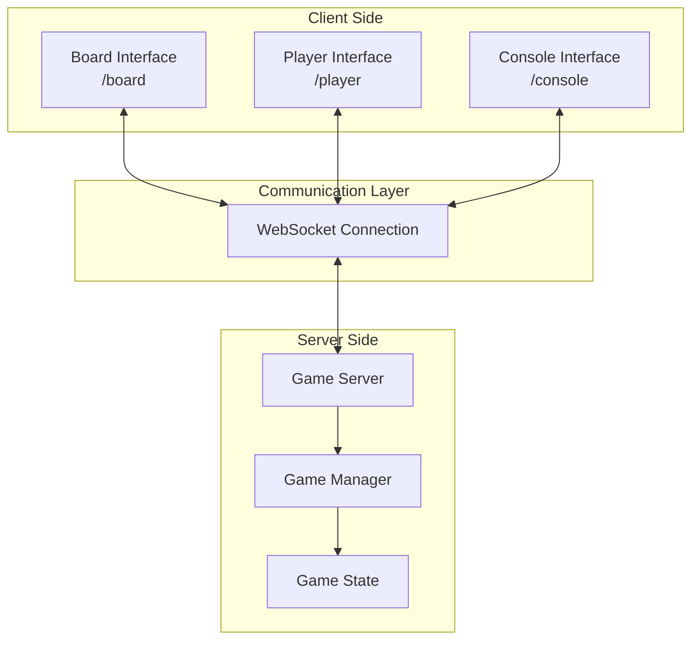
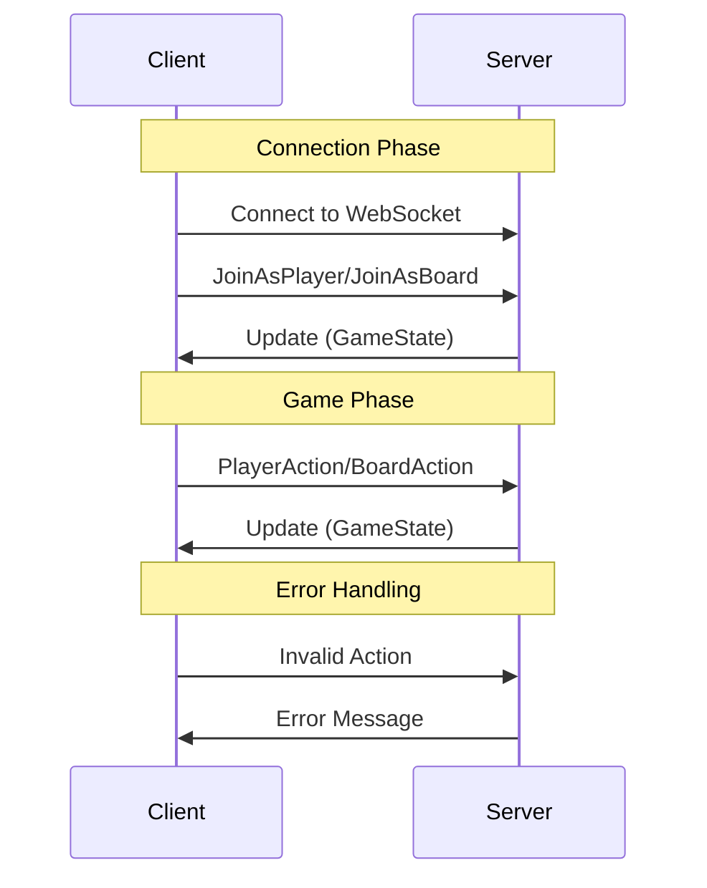
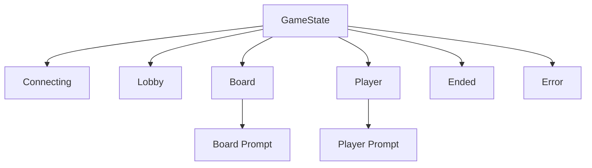
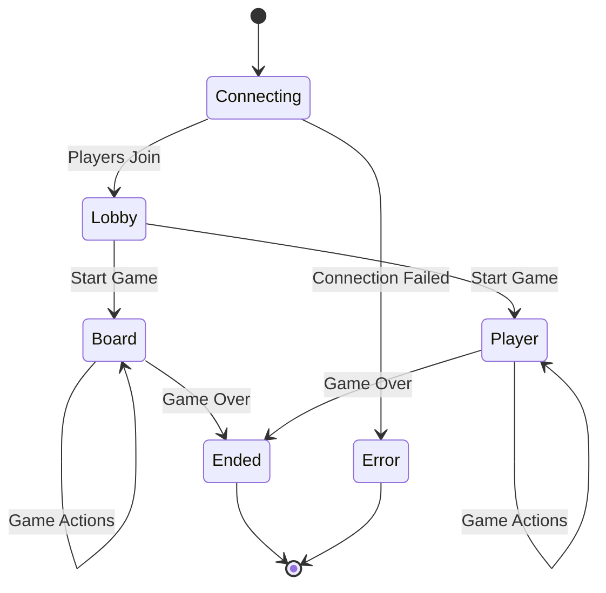
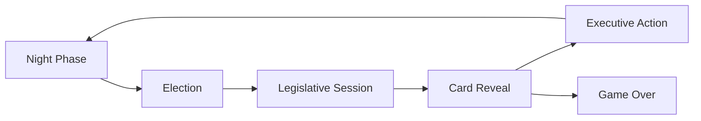

# Secret Hitler Game Architecture Documentation

## Overview

This document describes the architecture of a web-based implementation of the Secret Hitler board game. The system consists of a client-side SolidJS application that communicates with a game server via WebSockets. The game supports multiple roles including Liberals, Fascists, Hitler, and optional special roles like Communist, Anarchist, Monarchist, Capitalist, and Centrist.

## System Architecture

### High-Level Architecture



### Technology Stack

- **Frontend Framework**: SolidJS with TypeScript
- **Build Tool**: Vite
- **Routing**: @solidjs/router
- **State Management**: SolidJS signals and stores
- **Communication**: WebSockets (websocket-ts library)
- **Validation**: Zod schema validation
- **Styling**: CSS Modules
- **Animation**: Motion One (@motionone/solid)

## Client Architecture

### Application Structure

The client application is organized into three main interfaces:

1. **Board Interface** (`/board`) - Displays the game state for all players to see
2. **Player Interface** (`/player`) - Individual player's private view and controls
3. **Console Interface** (`/console`) - Administrative or debugging interface

### Directory Structure

```
src/
├── assets/          # Game images and sounds
├── board/           # Board interface components
│   └── modals/      # Board-specific modal dialogs
├── components/      # Shared components
├── dm/              # Domain models and types
├── pages/           # Route page components
├── player/          # Player interface components
└── util/            # Utility functions
```

### Key Components

#### Board Interface Components
- `BoardApp.tsx` - Main board application container
- `BoardContent.tsx` - Game board display logic
- `PlayerRail.tsx` - Display of all players
- `PolicyTracker.tsx` - Tracks enacted policies
- Various modal components for game phases

#### Player Interface Components
- `PlayerApp.tsx` - Main player application container
- `Prompt.tsx` - Handles player action prompts
- `CardSelector.tsx` - Policy card selection UI
- `RoleTab.tsx` - Displays player's secret role
- `Lobby.tsx` - Pre-game lobby interface

## Communication Protocol

### WebSocket Message Flow



### Client-to-Server Messages

1. **Connection Messages**
   - `CreateGame` - Create a new game with options
   - `JoinAsPlayer` - Join as a player with name
   - `JoinAsBoard` - Join as the board display
   - `LeaveGame` - Leave the current game

2. **Game Control Messages**
   - `StartGame` - Start the game (from lobby)
   - `EndGame` - End the current game

3. **Action Messages**
   - `PlayerAction` - Player-specific actions
   - `BoardAction` - Board-specific actions

### Server-to-Client Messages

1. **State Updates**
   ```typescript
   {
     type: 'update',
     state: GameState
   }
   ```

2. **Error Messages**
   ```typescript
   {
     type: 'error',
     error: string
   }
   ```

## Game State Management

### State Structure

The game state is managed through a discriminated union pattern with different state types:



### Core State Types

1. **GameState** - Root state containing:
   - `game_id`: Unique game identifier
   - `name`: Player name (null for board)
   - `players`: Array of public player information
   - `state`: Current game phase state

2. **BoardState** - Public game state visible to all:
   - Election tracker
   - Policy cards (Liberal, Fascist, Communist)
   - Draw pile count
   - Presidential turn order
   - Last government
   - Current prompt

3. **PlayerState** - Private player state:
   - Player name
   - Secret role
   - Investigation results
   - Current prompt

### State Transitions



## Game Flow

### Phase Progression



### Action Types

#### Player Actions
- `EndNightRound` - Acknowledge night phase
- `ChoosePlayer` - Select another player
- `CastVote` - Vote Ja or Nein
- `Discard` - Discard a policy card
- `VetoAgenda` - Request veto (Chancellor)
- `AcceptVeto` / `RejectVeto` - President's veto response
- Special actions for variant roles

#### Board Actions
- `EndVoting` - Complete voting phase
- `EndCardReveal` - Complete policy reveal
- `EndExecutiveAction` - Complete executive action
- `EndLegislativeSession` - Complete legislation
- Special actions for variant game modes

## Routing and Navigation

### Route Structure

```typescript
<Router>
  <Route path="/board" component={BoardPage} />
  <Route path="/player" component={PlayerPage} />
  <Route path="/console" component={ConsolePage} />
</Router>
```

### URL Parameters
- Board: `/board?game={gameId}`
- Player: `/player?game={gameId}&name={playerName}`

## Security Considerations

1. **State Isolation**: Player states are isolated - each player only receives their own private information
2. **Action Validation**: All actions are validated server-side
3. **Game ID**: Uses validated 4-character game IDs
4. **No Authentication**: Relies on game ID and player name for access

## Special Features

### Audio System
- Sound effects for game events
- Background music support
- Audio context management for browser compatibility

### Visual Features
- Animated transitions using Motion One
- Confetti effects for game victories
- Responsive design for various screen sizes
- QR code generation for easy game sharing

### Game Variants
The system supports multiple game variants through configurable options:
- Communist expansion
- Monarchist role
- Anarchist role
- Capitalist role
- Centrist role

## Development Considerations

### Type Safety
- Extensive use of TypeScript
- Zod schemas for runtime validation
- Discriminated unions for state management

### Code Organization
- Separation of concerns (UI, state, communication)
- Modular component structure
- Shared utilities and hooks

### Performance
- Efficient WebSocket reconnection with backoff
- Lazy loading of assets
- Optimized build configuration

## Future Enhancements

Based on the TODO file, planned improvements include:
- Anarchist role interactions
- Enhanced Communist session UI
- Radicalisation reveal UI
- Confession UI improvements
- Better support for 10+ players
- Console autoplay feature
- Hitler zone warnings
- Improved president/chancellor icons