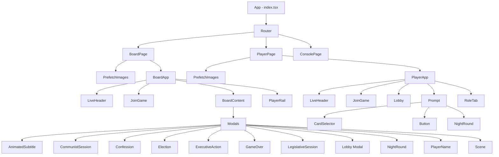
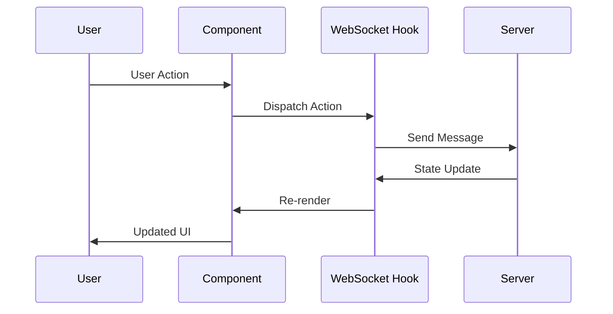

# Secret Hitler Component Hierarchy

## Component Tree Structure



## Component Responsibilities

### Page Components

#### BoardPage (`/pages/Board.tsx`)
- Manages board view routing
- Handles game ID from URL params
- Initiates board connection

#### PlayerPage (`/pages/Player.tsx`)
- Manages player view routing
- Handles game ID and player name from URL params
- Initiates player connection

#### ConsolePage (`/pages/Console.tsx`)
- Administrative/debug interface
- Game management controls

### Core Application Components

#### BoardApp (`/board/BoardApp.tsx`)
**Responsibilities:**
- WebSocket connection management for board
- Game state synchronization
- Audio context initialization
- Error handling and display
- Routing between game states

**Key Features:**
- Auto-joins as board when game ID provided
- Handles game creation flow
- Resume game functionality

#### PlayerApp (`/player/PlayerApp.tsx`)
**Responsibilities:**
- WebSocket connection management for player
- Player state management
- Authentication via game ID + name
- Prompt handling and action dispatch

**Key Features:**
- Auto-joins when credentials provided
- Role display management
- Dead player state handling

### Board Components

#### BoardContent (`/board/BoardContent.tsx`)
**Purpose:** Main game board display logic

**Manages:**
- Policy tracker display
- Current game phase modals
- Executive action displays
- Game outcome presentations

#### PlayerRail (`/board/PlayerRail.tsx`)
**Purpose:** Display all players in the game

**Features:**
- Shows player status (alive/dead)
- Indicates current president/chancellor
- Shows "not Hitler" confirmations
- Visual player arrangement

#### PolicyTracker (`/board/PolicyTracker.tsx`)
**Purpose:** Visual representation of enacted policies

**Displays:**
- Liberal policy track (0-5)
- Fascist policy track (0-6)
- Communist policy track (0-5, if enabled)
- Executive action indicators

### Player Components

#### Prompt (`/player/Prompt.tsx`)
**Purpose:** Central prompt handler for all player actions

**Handles:**
- Action-specific UI rendering
- User input collection
- Action dispatch to server
- Game control options

#### CardSelector (`/player/CardSelector.tsx`)
**Purpose:** Policy card selection interface

**Features:**
- Visual card display
- Selection state management
- Discard action handling
- Veto request option

#### RoleTab (`/player/RoleTab.tsx`)
**Purpose:** Display player's secret role

**Shows:**
- Role name and affiliation
- Role-specific information
- Visual role card

#### Lobby (`/player/Lobby.tsx`)
**Purpose:** Pre-game waiting room

**Features:**
- Player count display
- Start game button (when eligible)
- Game ID display
- QR code for sharing

### Modal Components

#### Scene (`/board/modals/Scene.tsx`)
**Purpose:** Base modal container

**Provides:**
- Consistent modal styling
- Animation transitions
- Content wrapper

#### Election (`/board/modals/Election.tsx`)
**Purpose:** Display election process

**Shows:**
- Nominated president/chancellor
- Vote counting animation
- Election outcome

#### LegislativeSession (`/board/modals/LegislativeSession.tsx`)
**Purpose:** Policy passing visualization

**Phases:**
- President draws 3 cards
- Chancellor receives 2 cards
- Policy enactment
- Veto process (if applicable)

#### ExecutiveAction (`/board/modals/ExecutiveAction.tsx`)
**Purpose:** Display executive powers

**Actions:**
- Investigation results
- Execution announcements
- Special election calls
- Policy peek
- Other special powers

#### GameOver (`/board/modals/GameOver.tsx`)
**Purpose:** Game end screen

**Shows:**
- Winning team
- Victory condition
- Final game state
- Confetti animation (for winners)

### Shared Components

#### LiveHeader (`/components/LiveHeader.tsx`)
**Purpose:** Connection status and game info

**Displays:**
- Connection indicator
- Game ID (board) or Player name
- Visual connection feedback

#### Error (`/components/Error.tsx`)
**Purpose:** Error message display

**Features:**
- Consistent error styling
- User-friendly messages
- Action suggestions

#### Confetti (`/components/Confetti.tsx`)
**Purpose:** Victory celebration effect

**Features:**
- Particle animation
- Team-colored confetti
- Performance optimized

#### PrefetchImages (`/components/Prefetch.tsx`)
**Purpose:** Preload game assets

**Loads:**
- Card images
- Board backgrounds
- Role cards
- UI elements

## Component Communication Patterns

### Props Flow
```
BoardApp/PlayerApp (WebSocket State)
    ├── State Props → Child Components
    ├── Action Callbacks → User Interactions
    └── WebSocket Actions → Server Updates
```

### State Management Pattern
1. **WebSocket Hook** (`createWs`) provides:
   - Connection state
   - Game state
   - Action dispatchers

2. **Components** consume:
   - Read state via props
   - Dispatch actions via callbacks
   - No direct state mutation

### Event Flow


## Styling Architecture

### CSS Modules
Each component has an associated `.module.css` file:
- Scoped styles prevent conflicts
- Component-specific classes
- Consistent naming convention

### Style Organization
```
ComponentName.tsx
ComponentName.module.css
```

### Common Patterns
- `.Container` - Main component wrapper
- `.Title` - Component headings
- `.Content` - Main content area
- `.Actions` - Button/action areas

## Performance Considerations

### Component Optimization
1. **Lazy Loading**: Routes are code-split
2. **Memoization**: Complex computations cached
3. **Conditional Rendering**: Show/Match for efficiency
4. **Asset Preloading**: Images loaded upfront

### Re-render Optimization
- SolidJS reactive system minimizes re-renders
- Fine-grained reactivity at signal level
- No virtual DOM overhead

## Testing Considerations

### Component Testing Strategy
1. **Unit Tests**: Individual component logic
2. **Integration Tests**: Component interactions
3. **E2E Tests**: Full game flow scenarios

### Key Test Scenarios
- Connection/disconnection handling
- State synchronization
- Action validation
- Error recovery
- Game flow progression