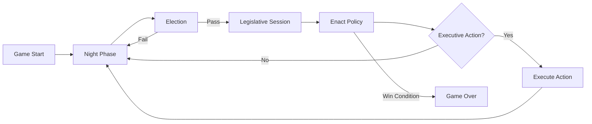

# Secret Hitler Game Architecture Overview

This repository contains a web-based implementation of the Secret Hitler board game with support for various expansion roles. The architecture documentation is organized into several detailed documents:

## 📚 Documentation Structure

### [ARCHITECTURE.md](./ARCHITECTURE.md)
The main architecture document covering:
- System overview and technology stack
- Client-server architecture
- Communication protocols
- Game state management
- Routing and navigation
- Security considerations
- Development setup

### [TECHNICAL_SPEC.md](./TECHNICAL_SPEC.md)
Detailed technical specifications including:
- Domain models and type definitions
- WebSocket protocol details
- Executive actions and game rules
- Audio system implementation
- Performance optimizations
- Known issues and future considerations

### [COMPONENT_HIERARCHY.md](./COMPONENT_HIERARCHY.md)
Complete component structure documentation:
- Visual component tree
- Component responsibilities
- Communication patterns
- Styling architecture
- Testing strategies

## 🏗️ Architecture Summary

### System Design
- **Frontend**: SolidJS single-page application
- **Communication**: WebSocket-based real-time updates
- **State Management**: Server-authoritative with client synchronization
- **Routing**: Three main interfaces (Board, Player, Console)

### Key Features
- **Multi-role Support**: Liberal, Fascist, Hitler, plus optional Communist, Anarchist, Monarchist, Capitalist, and Centrist
- **Real-time Gameplay**: WebSocket communication for instant updates
- **Audio Integration**: Sound effects and background music
- **Responsive Design**: Separate interfaces for board display and player devices
- **Type Safety**: Full TypeScript with Zod validation

### Architecture Principles
1. **Separation of Concerns**: Clear distinction between board view and player views
2. **Server Authority**: All game logic validated server-side
3. **Type Safety**: Extensive TypeScript usage with runtime validation
4. **Modular Design**: Component-based architecture with clear responsibilities
5. **Real-time First**: Built for synchronous multiplayer experience

## 🎮 Game Flow



## 🔧 Development Quick Start

```bash
# Install dependencies
npm install

# Start development server
npm run dev

# Build for production
npm run build
```

### Environment Setup
Create a `.env` file:
```env
VITE_WS_URL=ws://localhost:8080
```

## 📁 Project Structure

```
src/
├── assets/          # Images and sounds
├── board/           # Board interface components
├── components/      # Shared components
├── dm/              # Domain models
├── pages/           # Route pages
├── player/          # Player interface components
└── util/            # Utilities
```

## 🔒 Security Notes

- No built-in authentication (relies on game ID + player name)
- All actions validated server-side
- WebSocket should use WSS in production
- Consider rate limiting for production deployment

## 🚀 Future Enhancements

Based on the TODO file:
- Fix "resume game" functionality
- Complete Anarchist role implementation
- Enhance Communist session UI
- Improve support for 10+ players
- Add Hitler zone warnings
- Implement console autoplay

## 📊 Performance Characteristics

- **Build Target**: Modern browsers (ESNext)
- **Bundle Size**: Optimized with Vite
- **Real-time Latency**: Dependent on WebSocket connection
- **Scalability**: Single server design (consider horizontal scaling for production)

## 🤝 Contributing

When contributing to this project:
1. Maintain type safety with TypeScript
2. Follow the established component patterns
3. Ensure WebSocket messages match protocol
4. Test with multiple players/