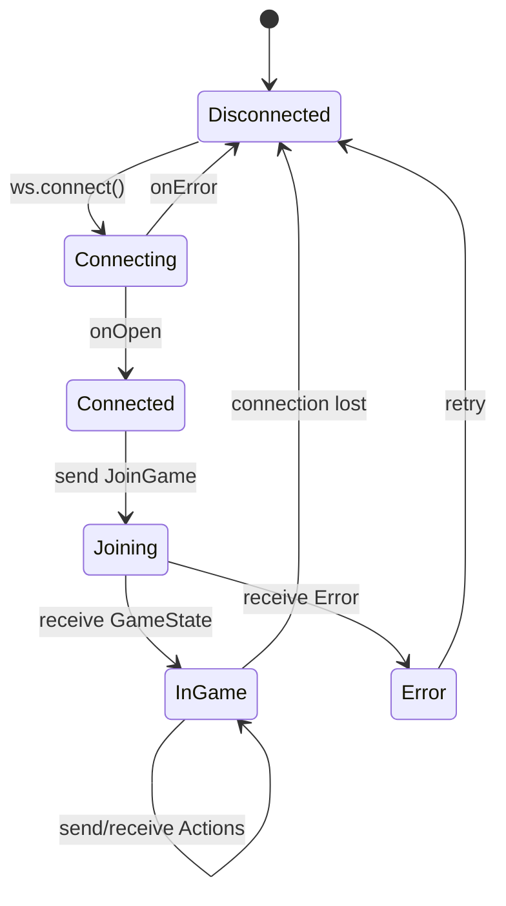

# Secret Hitler Technical Specification

## Domain Models

### Role System

The game implements a sophisticated role system with various factions:

```typescript
// Base parties
type Party = 'Liberal' | 'Fascist' | 'Communist'

// All possible roles
type Role = 
  | 'Liberal'
  | 'Fascist' 
  | 'Hitler'
  | 'Monarchist'
  | 'Capitalist'
  | 'Centrist'
  | 'Communist'
  | 'Anarchist'
```

### Game Actions

#### Player Actions
```typescript
type PlayerAction =
  | { type: 'EndNightRound' }
  | { type: 'EndCardReveal' }
  | { type: 'EndExecutiveAction' }
  | { type: 'VetoAgenda' }
  | { type: 'AcceptVeto' }
  | { type: 'RejectVeto' }
  | { type: 'StartAssassination' }
  | { type: 'EndCongress' }
  | { type: 'HijackElection' }
  | { type: 'ChoosePlayer'; name: string }
  | { type: 'CastVote'; vote: boolean }
  | { type: 'Discard'; index: number }
```

#### Board Actions
```typescript
type BoardAction = {
  type: 
    | 'EndVoting'
    | 'EndCardReveal'
    | 'EndExecutiveAction'
    | 'EndLegislativeSession'
    | 'EndAssassination'
    | 'EndCommunistStart'
    | 'EndCommunistEnd'
    | 'StartSpecialElection'
}
```

### Prompt System

The game uses a prompt-based system to guide players and the board through different game phases:

#### Board Prompts
- `Night` - Night phase introduction
- `Election` - Presidential election phase
- `LegislativeSession` - Policy card passing
- `CardReveal` - Reveal enacted policy
- `Execution` - Execute a player
- `InvestigatePlayer` - Investigate loyalty
- `SpecialElection` - Call special election
- `Assassination` - Anarchist assassination
- `CommunistSession` - Communist special powers
- `PolicyPeak` - Peek at top policies
- `FiveYearPlan` - Communist five year plan
- `MonarchistElection` - Monarchist special election
- `Confession` - Player confession
- `GameOver` - Game end state

#### Player Prompts
- `Night` - Night phase for player
- `ChoosePlayer` - Select another player for various actions
- `Vote` - Cast Ja/Nein vote
- `PresidentDiscard` - President discards 1 of 3 cards
- `ChancellorDiscard` - Chancellor discards 1 of 2 cards
- `ApproveVeto` - President approves/rejects veto
- `StartElection` - Begin new election round
- `EndCongress` - End communist congress
- `InvestigatePlayer` - View investigation result
- `PolicyPeak` - View top 3 policies
- `Radicalisation` - Radicalisation attempt result
- `HijackElection` - Option to hijack election
- `Dead` - Player has been executed
- `GameOver` - Game end with win/loss status

## WebSocket Protocol Details

### Message Format

All WebSocket messages are JSON-encoded with the following patterns:

#### Client → Server
```json
// Join as player
{
  "JoinAsPlayer": {
    "game_id": "ABCD",
    "name": "PlayerName"
  }
}

// Join as board
{
  "JoinAsBoard": {
    "game_id": "ABCD",
    "name": null
  }
}

// Create new game
{
  "CreateGame": {
    "options": {
      "communists": false,
      "monarchist": false,
      "anarchist": false,
      "capitalist": false,
      "centrists": false
    }
  }
}

// Player action
{
  "PlayerAction": {
    "type": "CastVote",
    "vote": true
  }
}

// Board action
{
  "BoardAction": {
    "type": "EndVoting"
  }
}
```

#### Server → Client
```json
// State update
{
  "type": "update",
  "state": {
    "game_id": "ABCD",
    "name": "PlayerName",
    "players": [...],
    "state": {
      "type": "board",
      // ... board state details
    }
  }
}

// Error
{
  "type": "error",
  "error": "game does not exist"
}
```

## State Management Details

### Connection State Machine



### Game State Synchronization

The client maintains a local copy of the game state that is updated whenever the server sends a state update. The state management follows these principles:

1. **Single Source of Truth**: Server maintains authoritative game state
2. **Optimistic Updates**: None - all updates come from server
3. **Validation**: Client validates incoming messages with Zod schemas
4. **Error Recovery**: Automatic reconnection with exponential backoff

## Executive Actions

Executive actions are triggered based on the number of fascist policies enacted:

### Fascist Track (5-6 players)
1. No power
2. No power
3. Policy Peek
4. Execution
5. Execution & Veto Power

### Fascist Track (7-8 players)
1. No power
2. Investigate Loyalty
3. Special Election
4. Execution
5. Execution & Veto Power

### Fascist Track (9-10 players)
1. Investigate Loyalty
2. Investigate Loyalty
3. Special Election
4. Execution
5. Execution & Veto Power

### Communist Track (when enabled)
1. No power
2. Five Year Plan
3. Congress
4. Confession
5. Radicalisation

## Game Configuration

### Player Count Requirements
- Minimum: 5 players
- Maximum: 10 players (UI optimization needed for 10+)

### Role Distribution

| Players | Liberals | Fascists | Hitler |
|---------|----------|----------|--------|
| 5       | 3        | 1        | 1      |
| 6       | 4        | 1        | 1      |
| 7       | 4        | 2        | 1      |
| 8       | 5        | 2        | 1      |
| 9       | 5        | 3        | 1      |
| 10      | 6        | 3        | 1      |

### Special Roles (Optional)
- **Communist**: Replaces 1 Liberal
- **Anarchist**: Replaces 1 Fascist
- **Monarchist**: Replaces 1 Fascist
- **Capitalist**: Replaces 1 Liberal
- **Centrist**: Replaces 1 Liberal

## Audio System

### Sound Effects
The game includes sound effects for key events:

```typescript
// Sound file mapping
const sounds = {
  'cast-vote.mp3': 'Vote casting',
  'click.mp3': 'UI clicks',
  'drum roll final.mp3': 'Dramatic reveal',
  'elect a chancellor.mp3': 'Chancellor election',
  'execute player.mp3': 'Player execution',
  'fascist card.mp3': 'Fascist policy enacted',
  'liberal card.mp3': 'Liberal policy enacted',
  'fascist victory.mp3': 'Fascist team wins',
  'liberal victory.mp3': 'Liberal team wins',
  'hitler chancellor.mp3': 'Hitler elected chancellor',
  'hitler executed.mp3': 'Hitler executed',
  'investigate player.mp3': 'Investigation power',
  'ja1.mp3', 'ja2.mp3': 'Ja votes',
  'nein1.mp3', 'nein2.mp3': 'Nein votes',
  'player death.mp3': 'Player eliminated',
  'policy peek.mp3': 'Policy peek power',
  'remain silent.mp3': 'Silence prompt',
  'secret role.mp3': 'Role reveal',
  'special election.mp3': 'Special election called',
  'tension.mp3': 'Tension building',
  'veto call.mp3': 'Veto requested',
  'veto pass.mp3': 'Veto approved',
  'veto rejected.mp3': 'Veto rejected'
}
```

### Audio Context Management
- Handles browser autoplay restrictions
- Provides user interaction prompt to enable audio
- Manages background music (moonlight.mp3)

## Performance Optimizations

### Asset Loading
- Images are preloaded using a dedicated Prefetch component
- Sound files are loaded on-demand
- CSS modules for scoped styling

### WebSocket Optimization
- Linear backoff strategy: 1000ms initial, 250ms increment, 2500ms max
- Automatic reconnection on disconnect
- Message batching not implemented (real-time game)

### Build Configuration
```typescript
// vite.config.ts
{
  build: {
    target: 'esnext', // Modern browsers only
  }
}
```

## Security Considerations

### Input Validation
- Game IDs: 4 uppercase letters (validated with regex)
- Player names: Alphanumeric + spaces, 1-20 characters
- All server messages validated with Zod schemas

### Access Control
- No authentication system
- Security through obscurity (random game IDs)
- Players can only see their own private information
- Board view shows public information only

### Potential Vulnerabilities
1. **Replay Attacks**: No protection against replaying WebSocket messages
2. **Man-in-the-Middle**: WebSocket connection should use WSS in production
3. **Game ID Brute Force**: 456,976 possible combinations (26^4)
4. **No Rate Limiting**: Server should implement connection rate limits

## Development Workflow

### Local Development
```bash
npm install
npm run dev
# Opens on http://localhost:3000
```

### Environment Variables
```env
VITE_WS_URL=ws://localhost:8080  # WebSocket server URL
```

### Build Process
```bash
npm run build
# Output in dist/ directory
```

### Code Quality Tools
- TypeScript for type safety
- Zod for runtime validation
- CSS Modules for style isolation
- Prettier for code formatting (config included)

## Known Issues and Limitations

From the TODO file:
1. "Resume game" bug needs fixing
2. Anarchist role interactions incomplete
3. Communist session UI needs implementation
4. Radicalisation reveal UI missing
5. Confession UI needs work
6. Board join/create game UI needs improvement
7. 10+ player layout issues
8. Missing features:
   - Ja/Nein voting cards display
   - Console autoplay
   - Hitler zone warnings
   - Better president/chancellor icons

## Future Architecture Considerations

### Scalability
- Current architecture assumes single game server
- For scale, consider:
  - Multiple game servers with load balancing
  - Redis for game state storage
  - Horizontal scaling with sticky sessions

### Mobile Support
- Current UI optimized for desktop
- Mobile considerations:
  - Touch-friendly controls
  - Responsive layout for small screens
  - Portrait/landscape orientation handling

### Accessibility
- Add ARIA labels for screen readers
- Keyboard navigation support
- High contrast mode
- Sound effect subtitles/visual indicators